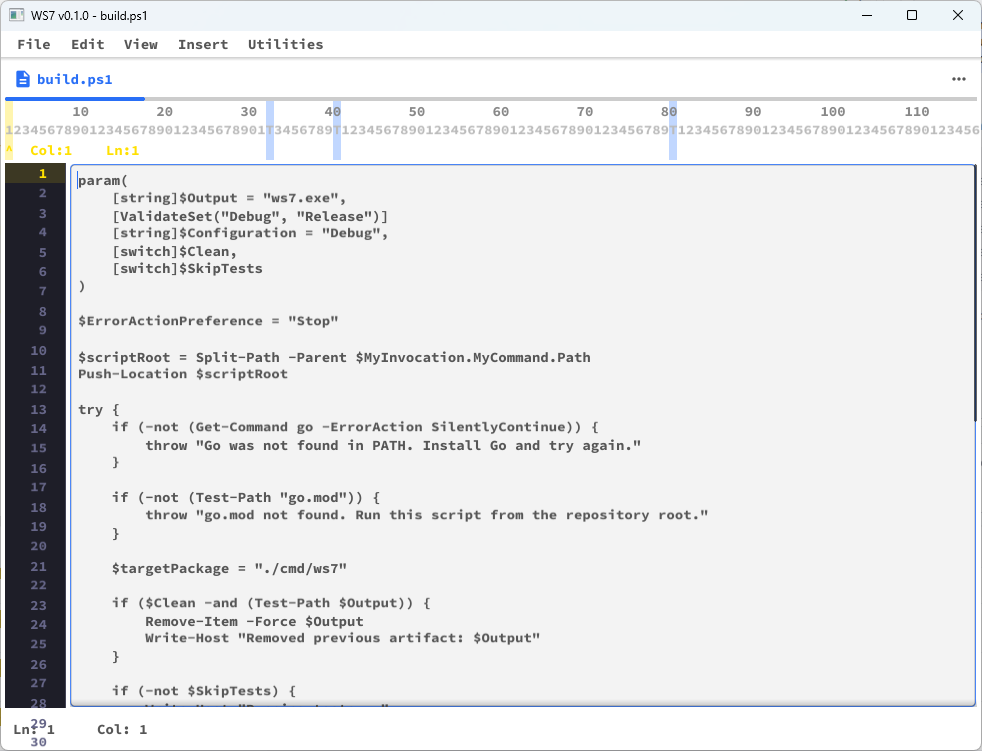

# WS7 Editor



Text editor in Go + Fyne, inspired by the WordStar 7.0 workflow, focused on MSX-BASIC development.

## Motivation and Inspiration

- Recreate a classic editing experience centered on keyboard-driven productivity.
- Preserve the WordStar 7 style `Ctrl` prefix command logic.
- Provide a modern environment for building software for the MSX ecosystem.

## Project Goals

- Deliver a lightweight editor/IDE for writing and organizing MSX-BASIC code.
- Maintain high interaction fidelity with WordStar before adding extra features.
- Persist settings and usage context (recent files and directories) for a continuous workflow.

## Technologies and Tools

- **Go**: main application language.
- **Fyne**: desktop GUI framework.
- **SQLite**: local settings and history storage.
- **PowerShell** (`build.ps1`): Windows build automation.
- **Go test / go build**: continuous validation of changes.

## Recent Changes

- Version build metadata is now centralized in `internal/version/version.go` (`0.1.0`).
- Application title and Status dialog show the running version.
- Opening Menu now includes:
  - `Utilities > Macros` (`MP`, `MR`, `MD`, `MS`, `MO`, `MY`, `ME`).
  - `Additional` tools (`AC`, `AH`, `AS`, `AG`, `AN`).
  - Rightmost `Help` menu (`HR`, `HM`, `HO`) rendering `README.md`, `MANUAL.md`, and `OUTLINE.md` as Markdown.
- Line-number gutter refresh was fixed (`internal/ui/linenumbers.go`) so full numbering updates correctly while scrolling/editing.
- Core editor behavior remains in place: tabs (`DocTabs`), dirty-tab indicator (`*`), duplicate-open focus, and unsaved-close confirmation.

## Main Structure

```text
cmd/ws7/main.go                  application entry point
internal/ui/editor.go            global state, screens, menus, and tabs
internal/ui/filebrowser.go       file navigation (Opening Menu)
internal/ui/theme.go             Source Code Pro theme
internal/ui/linenumbers.go       line-number gutter widget/renderer
internal/input/commands.go       Ctrl/WordStar command resolver
internal/store/sqlite/store.go   SQLite (settings, projects, recent_files)
internal/config/paths.go         local data paths
internal/version/version.go      app name/version constants
CHANGELOG.md                     release notes + Unreleased workflow
res/                             TTF fonts and wordstar7.pdf manual
build.ps1                        Windows build
```

## Usage Documentation

- Full operational guide: `MANUAL.md`
- Project continuity and migration state: `OUTLINE.md`
- Release notes and current pending changes: `CHANGELOG.md`

## Versioning and Releases

- Current app version starts at `0.1.0`.
- Bump version in `internal/version/version.go` before each release.
- Register new work under `## [Unreleased]` in `CHANGELOG.md`, then cut a dated version section.

## Quick Run

```bash
go mod tidy
go run ./cmd/ws7
```

## Build (Windows)

```powershell
./build.ps1
./build.ps1 -Configuration Release
./build.ps1 -Output dist/ws7.exe -SkipTests
```

## Tests

```bash
go test ./...
```
