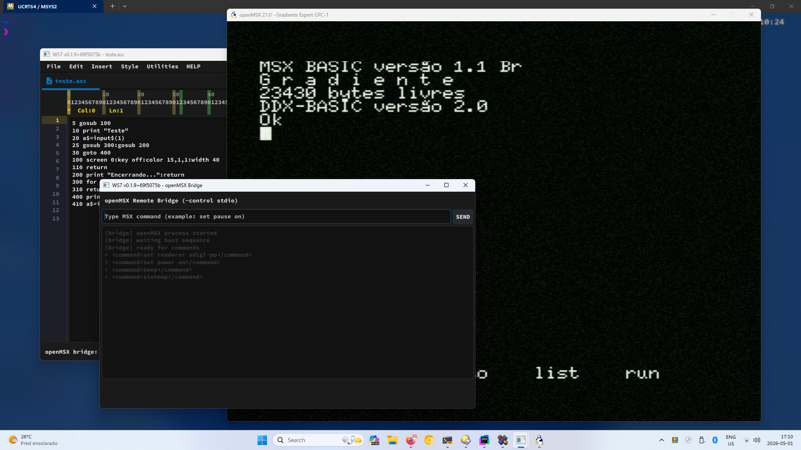

# WS7 Editor



Text editor in Go + Fyne, inspired by the WordStar 7.0 workflow, focused on MSX-BASIC development.

## Motivation and Inspiration

- Recreate a classic editing experience centered on keyboard-driven productivity.
- Preserve the WordStar 7 style `Ctrl` prefix command logic.
- Provide a modern environment for building software for the MSX ecosystem.

## Project Goals

- Deliver a lightweight editor/IDE for writing and organizing MSX-BASIC code.
- Maintain high interaction fidelity with WordStar before adding extra features.
- Persist settings and usage context (recent files and directories) for a continuous workflow.

## Technologies and Tools

- **Go**: main application language.
- **Fyne**: desktop GUI framework.
- **SQLite**: local settings and history storage.
- **PowerShell** (`build.ps1`): Windows build automation.
- **Go test / go build**: continuous validation of changes.

## Recent Changes

- **Current release is `0.1.9`** with major improvements to editor styling and tool integration.
- **Style > Font... (Ctrl+P,=)**: Configure bundled monospace fonts with family/size/weight/italic selection.
  - Supports Source Code Pro variants (ExtraLight, Light, Regular, Medium, SemiBold, Bold, ExtraBold, Black).
  - MSX Screen 0/1 fonts available.
  - Italic style available for Source Code Pro; line-number gutter and floating ruler adapt to font metrics.
- **Style > Bold (Ctrl+P,B)**: Toggle bold text rendering on current tab; gutter and ruler reflow automatically.
- **Configure enhancements**:
  - Folder browser popup for each tool location (Browse button).
  - Auto-detection of executable/script when folder is selected.
  - Per-tool lightweight `Test` probe execution (`--help`/`--version` / `--check`, etc.).
  - Pre-validation displays resolved path, probe command, and execution result before saving.
- **Utilities menu additions**:
  - `Open openMSX` - detached launch of MSX emulator.
  - `Run msxbas2rom` - convert MSX BASIC files.
  - `Run BASIC Dignified` - transpile BASIC Dignified syntax.
  - `Run MSX Encoding` - handle MSX text encoding.
  - Tool paths accept direct file paths or directories with auto-detection fallback.
- **Utilities > RULE (Regua)**: Floating 132-column character ruler overlay.
- **Top fixed ruler alignment fix**: The ruler now starts at text column 1 (right after the line-number gutter), instead of the far-left window edge.
- **Utilities > Calculator (Ctrl+Q,M)**: Expression calculator with arithmetic, bitwise, shifts/rotates.
- Editor `View` menu includes optional split syntax mode (Show/Hide Split Syntax Preview).
- Exiting the app checks unsaved changes across all open tabs.
- Build script supports `-Run` and `-OpenOutputFolder` options.

## Main Structure

```text
cmd/ws7/main.go                  application entry point
internal/ui/editor.go            global state, screens, menus, and tabs
internal/ui/filebrowser.go       file navigation (Opening Menu)
internal/ui/theme.go             Source Code Pro theme
internal/ui/linenumbers.go       line-number gutter widget/renderer
internal/input/commands.go       Ctrl/WordStar command resolver
internal/syntax/*                syntax highlighting registry + MSX-BASIC lexer
internal/store/sqlite/store.go   SQLite (settings, projects, recent_files)
internal/config/paths.go         local data paths
internal/version/version.go      app name/version constants
CHANGELOG.md                     release notes + Unreleased workflow
res/                             TTF fonts and wordstar7.pdf manual
build.ps1                        Windows build
```

## Usage Documentation

- Full operational guide: `MANUAL.md`
- Project continuity and migration state: `OUTLINE.md`
- Release notes and current pending changes: `CHANGELOG.md`
- Floating ruler technical notes: `FLOATING_RULER.md`
- Floating ruler quick guide: `FLOATING_RULER_GUIDE.md`

## Versioning and Releases

- Current app version is `0.1.9`.
- Bump version in `internal/version/version.go` before each release.
- Register new work under `## [Unreleased]` in `CHANGELOG.md`, then cut a dated version section.

## Quick Run

```bash
go mod tidy
go run ./cmd/ws7
```

## Build (Windows)

```powershell
./build.ps1
./build.ps1 -Configuration Release
./build.ps1 -Output dist/ws7.exe -SkipTests
./build.ps1 -Configuration Debug -NoConsole -Output dist/ws7_debug_gui.exe
./build.ps1 -Configuration Release -Console -Output dist/ws7_release_console.exe
```

`-NoConsole` and `-Console` are explicit overrides and cannot be used together.

## Tests

```bash
go test ./...
```
