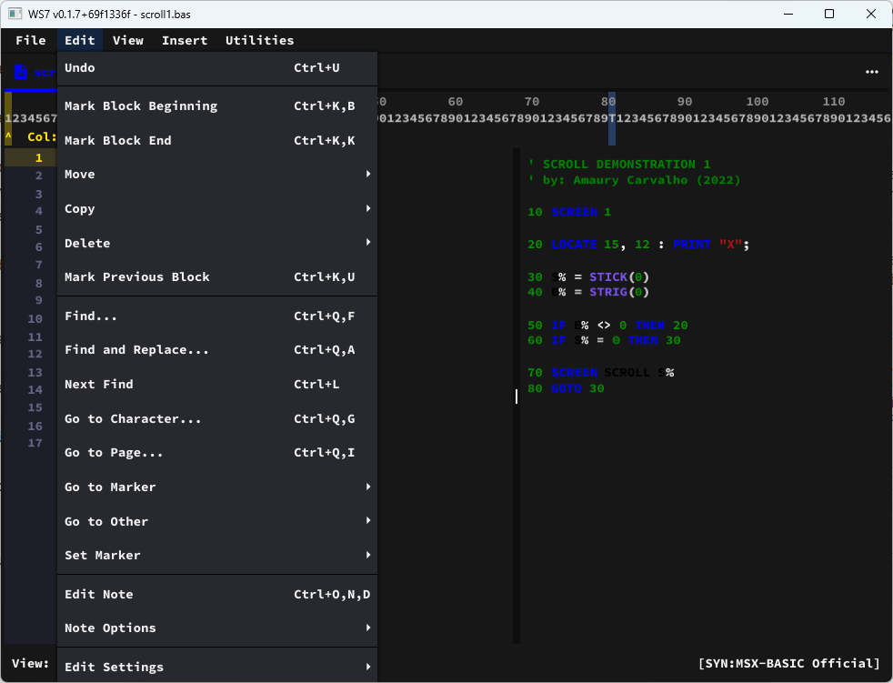

# WS7 Editor



Text editor in Go + Fyne, inspired by the WordStar 7.0 workflow, focused on MSX-BASIC development.

## Motivation and Inspiration

- Recreate a classic editing experience centered on keyboard-driven productivity.
- Preserve the WordStar 7 style `Ctrl` prefix command logic.
- Provide a modern environment for building software for the MSX ecosystem.

## Project Goals

- Deliver a lightweight editor/IDE for writing and organizing MSX-BASIC code.
- Maintain high interaction fidelity with WordStar before adding extra features.
- Persist settings and usage context (recent files and directories) for a continuous workflow.

## Technologies and Tools

- **Go**: main application language.
- **Fyne**: desktop GUI framework.
- **SQLite**: local settings and history storage.
- **PowerShell** (`build.ps1`): Windows build automation.
- **Go test / go build**: continuous validation of changes.

## Recent Changes

- Current release is `0.1.7`.
- `Utilities > RULE (Regua)` now opens a **floating 132-column character ruler** inside the editor.
- `RULE` current workflow:
  - `Ctrl+Q,R` toggles the ruler.
  - `ESC` exits RULE mode.
  - `B` marks block start / block end for inclusive span measurement.
  - The ruler is draggable and measures across multiple lines.
- `Utilities > Calculator` is now available in the editor.
  - Shortcut: `Ctrl+Q,M`.
  - Supports arithmetic, power, sqrt/int, bitwise ops, shifts and rotates.
  - Number input supports decimal, `&H` (hex) and `&B` (binary).
  - Results are shown in decimal, hexadecimal and binary.
- `Ctrl+O,L` is now used for `Document Beginning`.
- `Utilities > Configure...` is now available in both the Opening Menu and Editor Menu.
- Configure dialog now supports:
  - Editor theme selection (`Dark` / `Light`).
  - Executable path settings for `openMSX`, `msxbas2rom`, `BASIC Dignified`, and `MSX Encoding`.
- Editor `View` menu includes optional split syntax mode:
  - `Show Split Syntax Preview`
  - `Hide Split Syntax Preview`
  - Inline syntax highlighting remains active in normal mode.
- Exiting the app now checks for unsaved changes across all open tabs and asks for confirmation before closing.
- Build script improvements:
  - `./build.ps1 -Run` builds and runs the executable.
  - `./build.ps1 -OpenOutputFolder` opens the output folder after build.

## Main Structure

```text
cmd/ws7/main.go                  application entry point
internal/ui/editor.go            global state, screens, menus, and tabs
internal/ui/filebrowser.go       file navigation (Opening Menu)
internal/ui/theme.go             Source Code Pro theme
internal/ui/linenumbers.go       line-number gutter widget/renderer
internal/input/commands.go       Ctrl/WordStar command resolver
internal/syntax/*                syntax highlighting registry + MSX-BASIC lexer
internal/store/sqlite/store.go   SQLite (settings, projects, recent_files)
internal/config/paths.go         local data paths
internal/version/version.go      app name/version constants
CHANGELOG.md                     release notes + Unreleased workflow
res/                             TTF fonts and wordstar7.pdf manual
build.ps1                        Windows build
```

## Usage Documentation

- Full operational guide: `MANUAL.md`
- Project continuity and migration state: `OUTLINE.md`
- Release notes and current pending changes: `CHANGELOG.md`
- Floating ruler technical notes: `FLOATING_RULER.md`
- Floating ruler quick guide: `FLOATING_RULER_GUIDE.md`

## Versioning and Releases

- Current app version is `0.1.7`.
- Bump version in `internal/version/version.go` before each release.
- Register new work under `## [Unreleased]` in `CHANGELOG.md`, then cut a dated version section.

## Quick Run

```bash
go mod tidy
go run ./cmd/ws7
```

## Build (Windows)

```powershell
./build.ps1
./build.ps1 -Configuration Release
./build.ps1 -Output dist/ws7.exe -SkipTests
```

## Tests

```bash
go test ./...
```
